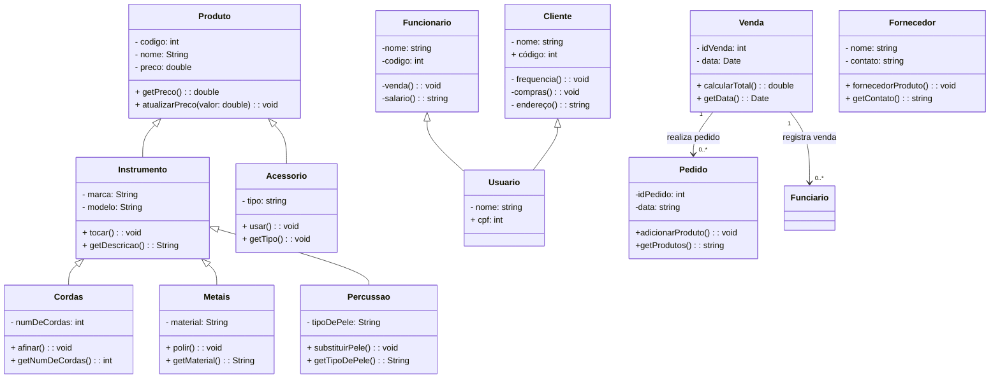

```mermaid
classDiagram
  class Produto {
    - codigo: int
    - nome: String
    - preco: double
    + getPreco(): double
    + atualizarPreco(valor: double): void
  }

  class Instrumento {
    - marca: String
    - modelo: String
    + tocar(): void
    + getDescricao(): String
  }

  class Cordas {
    - numDeCordas: int
    + afinar(): void
    + getNumDeCordas(): int
  }

  class Metais {
    - material: String
    + polir(): void
    + getMaterial(): String
  }

  class Percussao {
    - tipoDePele: String
    + substituirPele(): void 
    + getTipoDePele(): String
  }

  class Acessorio {
   - tipo: string
   + usar(): void
   + getTipo(): void
}
  Produto <|-- Instrumento
  Instrumento <|-- Cordas
  Instrumento <|-- Metais
  Instrumento <|-- Percussao
  Produto <|-- Acessorio

  class Usuario {
  - nome: string
  + cpf: int
}

  class Cliente {
  - nome: string
  + código: int
  - frequencia(): void
  -compras(): void
  - endereço(): string
}

class Funcionario {
  -nome: string
  -codigo: int
  -venda(): void
  -salario(): string
}

Funcionario <|-- Usuario
Cliente <|-- Usuario

  class Venda {
    - idVenda: int
    - data: Date
    + calcularTotal(): double
    + getData(): Date
  }

  class Pedido {
    -idPedido: int
    -data: string
    +adicionarProduto(): void
    +getProdutos(): string
  }

 class Fornecedor {
    - nome: string
    - contato: string
    + fornecedorProduto(): void
    + getContato(): string
  }

%% =============================
associações
%% ============================

Venda "1" --> "0..*" Pedido : realiza pedido
Venda "1" --> "0..*" Funciario : registra venda

%% ============================
Composições
%% ===========================


```
