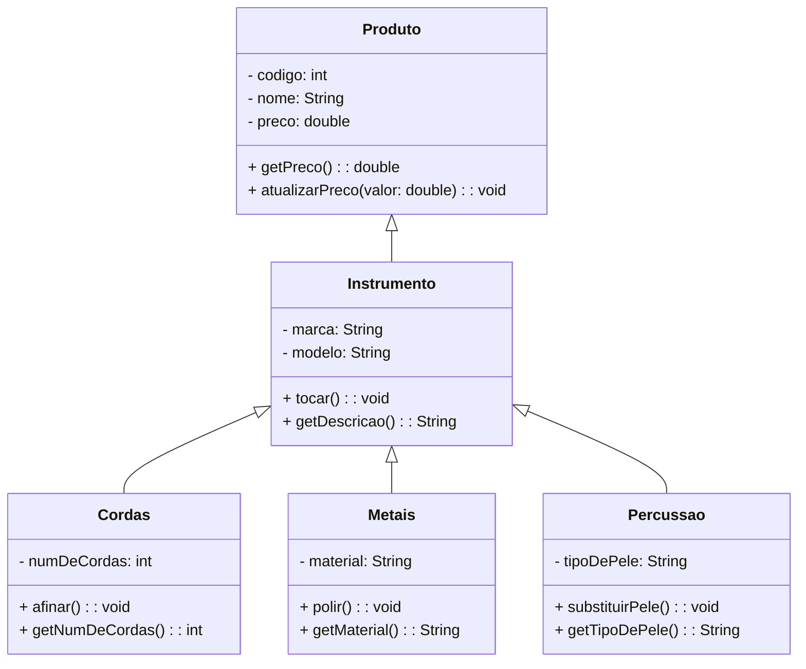

```mermaid
classDiagram
  class Produto {
    - codigo: int
    - nome: String
    - preco: double
    + getPreco(): double
    + atualizarPreco(valor: double): void
  }

  class Instrumento {
    - marca: String
    - modelo: String
    + tocar(): void
    + getDescricao(): String
  }

  class Cordas {
    - numDeCordas: int
    + afinar(): void
    + getNumDeCordas(): int
  }

  class Metais {
    - material: String
    + polir(): void
    + getMaterial(): String
  }

  class Percussao {
    - tipoDePele: String
    + substituirPele(): void 
    + getTipoDePele(): String
  }

  Produto <|-- Instrumento
  Instrumento <|-- Cordas
  Instrumento <|-- Metais
  Instrumento <|-- Percussao
```
