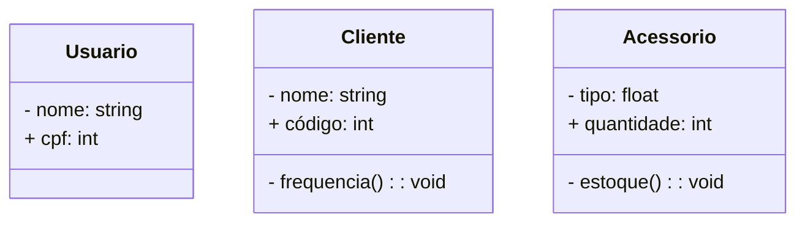

```mermaid
classDiagram
  class Usuario {
  - nome: string
  + cpf: int
}

  class Cliente {
  - nome: string
  + código: int
  - frequencia(): void
}

  class Acessorio {
  - tipo: float
  + quantidade: int
  - estoque(): void
}

```
